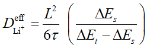
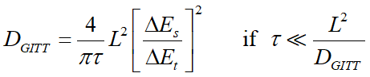

# GITT-Processing
GITT数据处理程序，通过输入的电压数据计算输出固相锂离子扩散系数，输入excel文件中记录了每一工步的起始电压，终止电压，程序会自动计算每一个弛豫电压处的固相锂离子扩散系数，并保存为excel文件。输入文件可以通过“蓝电数据LANDdt"软件提取，计算公式如下：  
>   

这是一个简化了的公式，可以在软件里更改为更标准的计算公式：  
>   

两个公式均由菲克第二定律的半无限扩散模型推导而来，计算结果可直接用于科研论文的数据表征。
运行环境只需要pandas和numpy两个库即可。