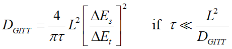

# GITT-Processing
GITT数据处理程序，通过输入的电压数据计算输出固相锂离子扩散系数，输入excel文件中记录了每一工步的起始电压，终止电压，程序会自动计算每一个弛豫电压处的固相锂离子扩散系数，并保存为excel文件。输入文件可以通过“蓝电数据LANDdt"软件提取，计算公式如下：  

>   

L为特征长度，表示锂离子扩散的有效路径长度，$\Delta E_s$表示脉冲前后平衡电势的差值，$\Delta E_t$表示脉冲过程中电压的变化值。该公式由菲克第二定律的半无限扩散模型推导而来，计算结果可直接用于科研论文的数据表征。
运行环境只需要pandas和numpy两个库即可。